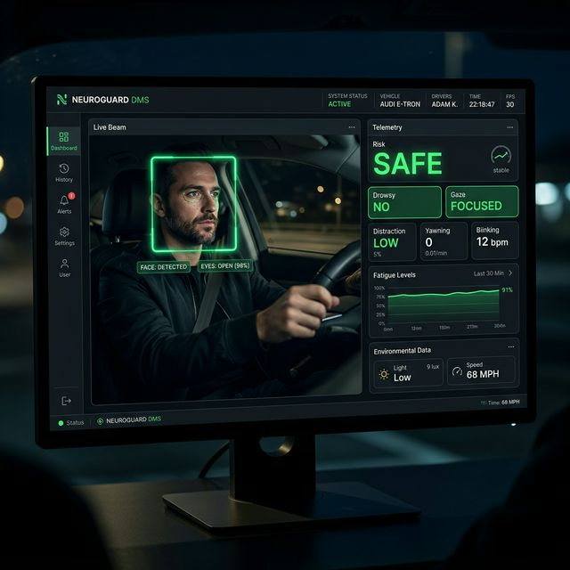

# VisionGuard: AI-Powered Driver Monitoring System

**VisionGuard** is a real-time Computer Vision solution designed to enhance road safety by monitoring driver attentiveness. It uses advanced Machine Learning models to detect signs of drowsiness, physical distraction (phone usage), and emotional state.



## 🚀 Features
- **Real-time Drowsiness Detection**: Evaluates Eye Aspect Ratio (EAR) using MediaPipe's facial landmarks and alerts the driver after sustained eye closure.
- **Phone Distraction Monitoring**: Utilizes Ultralytics YOLOv8 object detection to identify if the driver is actively looking at or holding a cell phone.
- **Emotional Telemetry**: DeepFace monitors the driver's general disposition (Stress, Anger, Focus) to contextualize the safety threat.
- **Weighted Risk Engine**: Combines all AI telemetry into a single, comprehensive `risk_score` (LOW, MEDIUM, HIGH) which tracks danger probabilistically.
- **Interactive Dashboard**: A massive Streamlit interface displaying real-time FPS, bounded-box webcam video, and live alert telemetry dynamically.

## 🛠️ Tech Stack
- **Languages**: Python 3.11+
- **Computer Vision**: OpenCV, MediaPipe (Face Mesh)
- **Object Detection & Emotion**: YOLOv8 (Ultralytics), DeepFace, Keras
- **UI Framework**: Streamlit

## 📦 Installation & Setup

1. **Clone the Repository**
   ```bash
   git clone https://github.com/hardik0903/CV_proj.git
   cd CV_proj
   ```

2. **Install Dependencies**
   (Note: Due to DeepFace, PyTorch, and TensorFlow, this installation is large).
   ```bash
   pip install -r requirements.txt
   ```

3. **Run the Dashboard**
   ```bash
   streamlit run app.py
   ```

4. **Launch the Real-Time Stream**
   - Head to `http://localhost:8501` in your browser.
   - Click **Start System** on the sidebar to initialize the AI inference models.

## 📐 Application Architecture
1. **Face Mesh**: Extracts 468 facial landmarks in 3D for perfect EAR ratio calculations.
2. **YOLO Inference**: Processes BGR frames locally to flag the "cell phone" object class seamlessly during the recording loop.
3. **Session State Loop**: `st.empty().image()` prevents the web socket from reloading the application thread and locking up the Deep Learning algorithms.

## 📄 License
MIT License - Developed as a Capstone BYOP Project for VITyarthi.
